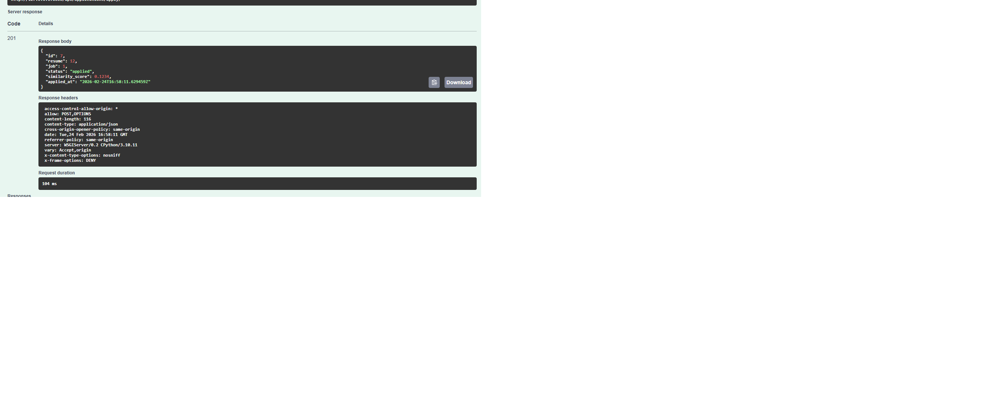
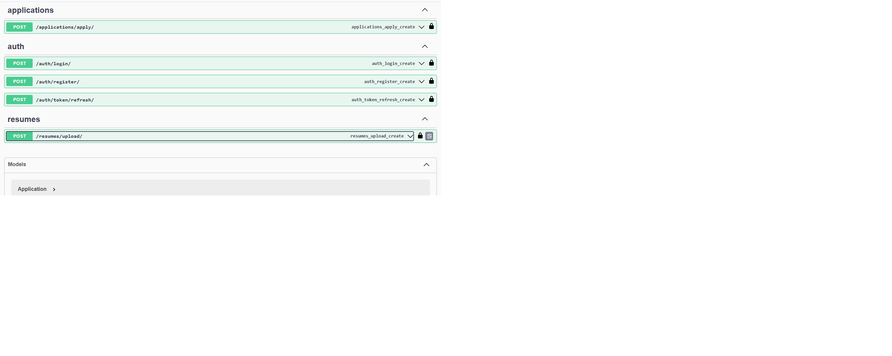

  

---

# ResumeMatch Scoring API

**ResumeMatch Scoring API** is a backend-focused project built with Django and Django REST Framework.  
It simulates a real-world job application system where users can upload resumes, apply for jobs, and get a similarity score between their resume and job description.  

This project focuses purely on backend functionality—there is no frontend UI.

---
---

## Demo

- Full API demonstration video:  
  https://drive.google.com/file/d/1eoSRTuswHbtlRLhkRefoL0aFZl25HQYU/view?usp=sharing

---

## What this project does

- **User Authentication:** Registration and login using JWT (email-based login).  
- **Resume Management:** Upload resumes in PDF format; background parsing with Celery. Extracted text is stored in MySQL.  
- **Job Management:** Admin-controlled creation, update, and deletion of job postings.  
- **Job Applications:** Users can apply to jobs; applications track status and similarity scores.  
- **Resume–Job Matching:** Calculates similarity score using TF-IDF vectorization + Cosine similarity between resume text and job description.  
- **Email Notifications:** Sends asynchronous email notifications to users after applying, showing job title, application status, and similarity score.  
- **API Documentation:** Fully documented and testable using Swagger (drf-yasg).

---

## Tech stack used

- **Backend:** Python, Django, Django REST Framework  
- **Authentication:** JWT (SimpleJWT)  
- **Task Queue:** Celery with Redis as message broker  
- **Database:** MySQL  
- **PDF Parsing:** PyMuPDF  
- **Machine Learning:** Scikit-learn (TF-IDF + Cosine Similarity)  
- **API Docs:** Swagger (drf-yasg)  
- **Environment Management:** python-dotenv


---

## Project structure

core/
├── __init__.py  
├── asgi.py  
├── celery.py  
├── settings.py  
├── urls.py  
├── wsgi.py  

accounts/
├── admin.py  
├── apps.py  
├── managers.py  
├── models.py  
├── serializers.py  
├── urls.py  
├── views.py  

resumes/
├── admin.py  
├── apps.py  
├── models.py  
├── serializers.py  
├── tasks.py  
├── urls.py  
├── views.py  

jobs/
├── admin.py  
├── apps.py  
├── models.py  
├── serializers.py  
├── urls.py  
├── views.py  

applications/
├── admin.py  
├── apps.py  
├── models.py  
├── serializers.py  
├── tasks.py  
├── urls.py  
├── utils.py  
├── views.py  

media/  
requirements.txt  
manage.py  

---

## Authentication

- **JWT Tokens** are used for all protected endpoints.  
- After login, the client receives:  
  - Access Token (short-lived)  
  - Refresh Token (longer-lived)  

**Header Example for Protected Endpoints:**

```
Authorization: Bearer <access_token>
```
---
## Resume Upload and Processing
- Users upload resumes in PDF format.  
- Resume text is **extracted asynchronously** using Celery tasks and stored in MySQL.  
- Parsing is non-blocking, ensuring API requests remain fast. This asynchronous approach prevents blocking API requests.
---
## Job Application Flow
1. User uploads a resume.  
2. User applies to a job.  
3. Resume text is compared with the job description.  
4. **TF-IDF + Cosine Similarity** generates a similarity score (0.0–1.0).  
5. Application status and similarity score are stored in MySQL.  
6. An email notification is sent asynchronously to the user with:  
   - Job title  
   - Application status  
   - Similarity score


Similarity scores vary depending on the resume content and job description.
---
## Celery Background Tasks

- Resume parsing  
- Sending application email notifications  

Redis is used as the Celery message broker.

---
## API documentation
Swagger UI is available at:
```
/swagger/
```
Swagger supports:
- JWT authorization
- File upload testing
- API request and response inspection

---
## Screenshots

### Resume–Job Similarity Score (Swagger Response)


### Swagger API Overview


---
## Environment variables

All sensitive values are stored in environment variables and are not committed to GitHub.
```
DJANGO_SECRET_KEY
DEBUG
DJANGO_ALLOWED_HOSTS
MYSQL_DATABASE
MYSQL_USER
MYSQL_PASSWORD
MYSQL_HOST
CELERY_BROKER_URL
EMAIL_HOST
EMAIL_HOST_USER
EMAIL_HOST_PASSWORD
EMAIL_USE_TLS
```
The `.env` file is excluded using `.gitignore`.
---
## Local setup
```
# Clone repository
git clone <repo-url>
cd ResumeMatch-API

# Create virtual environment
python -m venv venv
venv\Scripts\activate      # Windows
source venv/bin/activate   # Linux/Mac

# Install dependencies
pip install -r requirements.txt

# Configure .env with MySQL and email credentials

# Run migrations
python manage.py migrate

# Start Redis
redis-server

# Start Celery worker
celery -A core worker -l info

# Start Django server
python manage.py runserver
```
## Key Skills Demonstrated

* Django & Django REST Framework (ViewSets, Serializers, Filters, Pagination)
* JWT-based authentication
* Celery & Redis for asynchronous background processing
* Resume parsing from PDF (PyMuPDF)
* TF-IDF vectorization & Cosine similarity scoring (scikit-learn)
* Relational DB design with MySQL
* API documentation and testing with Swagger


 
